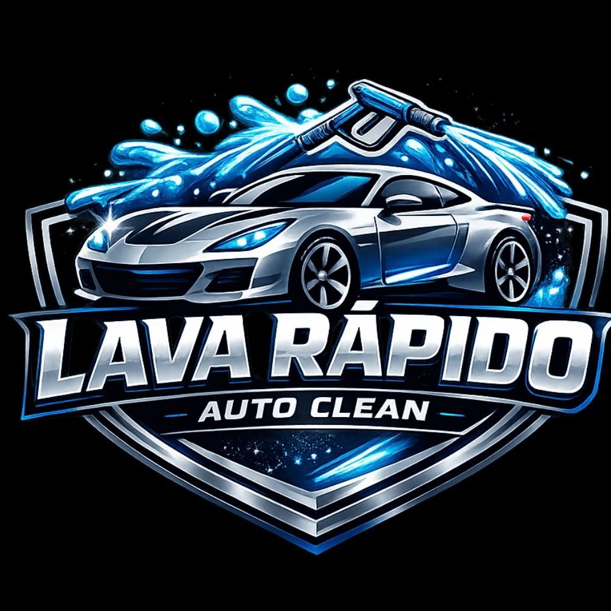
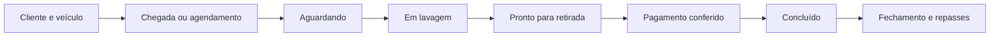
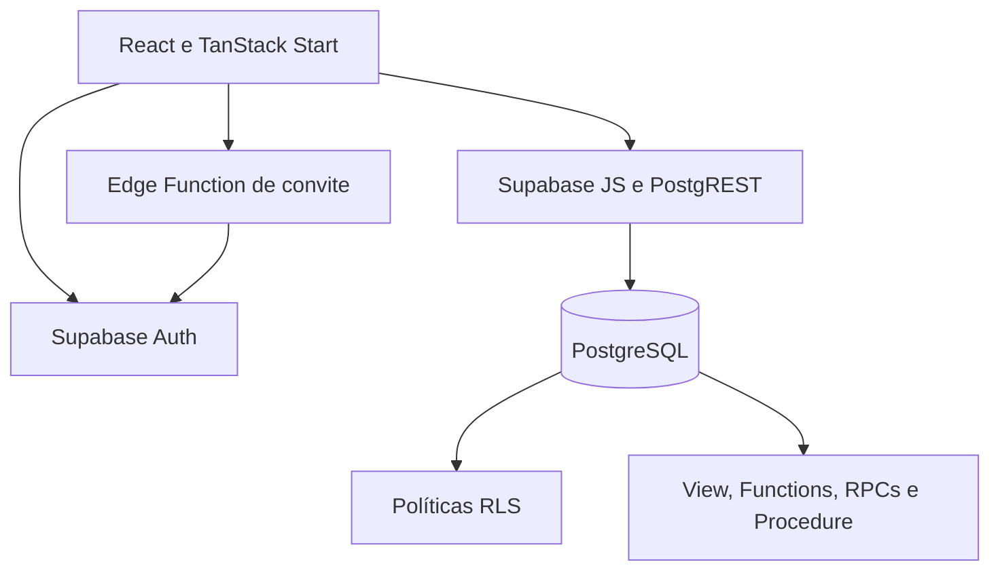

<div align="center">
  

# Auto Clean

**Gestão operacional e financeira para lava-jato**

Aplicação web responsiva para organizar atendimentos, clientes, veículos, pagamentos, repasses e fechamentos diários com segurança e rastreabilidade.


</div>

---

## 📌 Visão geral

O **Auto Clean** foi desenvolvido para resolver um problema real de gestão em lava-jato. O sistema acompanha o veículo desde a chegada ou o agendamento até a entrega, organiza a equipe responsável pelo serviço e mantém os lançamentos financeiros vinculados à data correta da operação.

A solução reúne em um único ambiente:

- controle visual da fila de atendimentos;
- cadastro de clientes e veículos;
- registro de serviços, participantes, valores e pagamentos;
- fechamento diário e cálculo de repasses;
- relatórios por dia, período ou histórico completo;
- separação de acesso entre administrador e lavador.

Além do uso operacional, o projeto demonstra a aplicação de **View, Functions, Procedure, RPCs, autenticação e políticas RLS** em PostgreSQL com Supabase.

## 🎯 Problema e solução

O controle manual de um lava-jato dificulta saber em qual etapa cada veículo se encontra, quais valores foram pagos e quanto deve ser destinado à empresa e aos lavadores.

Esse processo também aumenta o risco de:

- cadastros duplicados;
- divergências em pagamentos;
- erros no rateio de centavos;
- fechamentos repetidos;
- alterações financeiras sem histórico;
- perda de informações operacionais.

O Auto Clean resolve esse cenário por meio de uma central de atendimentos por data, regras de integridade no banco e operações financeiras auditáveis.

## ✨ Funcionalidades

### Atendimentos

- fila organizada por data e etapa;
- estados **aguardando**, **em lavagem**, **pronto para retirada** e **concluído**;
- atendimento imediato, retroativo ou agendado;
- seleção de serviço, categoria do veículo e lavadores participantes;
- valor informado na chegada ou mantido como pendente;
- edição administrativa em qualquer etapa;
- cancelamento com registro de motivo;
- histórico das alterações relevantes.

### Clientes e veículos

- clientes apresentados em ordem alfabética;
- múltiplos veículos associados ao mesmo cliente;
- inclusão de novos veículos em cadastros existentes;
- placa opcional;
- normalização da placa realizada pelo banco;
- busca rápida para reduzir cadastros duplicados.

### Pagamentos e entrega

- pagamento único ou dividido entre diferentes métodos;
- QR Code Pix disponível na própria interface;
- conferência entre preço final e total pago;
- bloqueio da entrega quando os valores não fecham;
- tratamento de valores em centavos sem perda de precisão;
- registro do pagamento associado ao atendimento.

### Repasses e fechamentos

- consulta dos serviços realizados em diferentes datas;
- cálculo da parte da empresa e dos lavadores;
- rateio determinístico dos centavos restantes;
- criação de fechamentos atuais ou retroativos;
- reabertura auditada para correções autorizadas;
- ajustes posteriores sem apagar lançamentos confirmados;
- proteção contra fechamento duplicado da mesma data.

### Acesso e relatórios

- login e encerramento de sessão;
- convite de novos usuários;
- recuperação e definição de senha;
- primeiro acesso pelo Supabase Auth;
- áreas específicas para administrador e lavador;
- relatórios de atendimentos e repasses;
- seleção por dia, intervalo de datas ou histórico completo;
- exportação respeitando as permissões do usuário.

O detalhamento funcional e os critérios de aceite estão no [levantamento de requisitos](docs/levantamento-requisitos.md).

## 👥 Perfis de usuário

| Perfil | Responsabilidades principais |
| --- | --- |
| **Administrador** | Gerencia usuários, configurações, atendimentos, pagamentos, relatórios, fechamentos e ajustes |
| **Lavador** | Consulta e participa do fluxo dos atendimentos conforme suas permissões |

A separação completa de acesso está documentada na [matriz de permissões](docs/matriz-permissoes.md).

## 🔄 Fluxo principal



Cada atendimento permanece associado à sua data operacional, mesmo quando o pagamento é registrado posteriormente. Essa regra mantém relatórios e repasses coerentes com o dia em que o serviço foi realizado.

## 🧩 Arquitetura



| Camada | Responsabilidade |
| --- | --- |
| **Interface** | Telas responsivas, formulários, validações e experiência do usuário |
| **Aplicação** | Consultas, cache e coordenação dos fluxos |
| **Autenticação** | Sessão, convite, recuperação de senha e identificação do perfil |
| **Banco de dados** | Integridade, permissões, cálculos, auditoria e persistência |
| **Edge Function** | Convite administrativo executado somente no ambiente seguro |
| **Integração contínua** | Lint, testes e build executados pelo GitHub Actions |

O fluxo técnico completo está em [Arquitetura do Auto Clean](docs/arquitetura.md).

## 🗄️ Banco de dados

O sistema utiliza **PostgreSQL hospedado no Supabase Cloud**.

### Principais entidades

| Domínio | Tabelas |
| --- | --- |
| Pessoas e acesso | `perfis`, `papeis_perfil` |
| Clientes e veículos | `clientes`, `veiculos`, `categorias_veiculo` |
| Catálogo | `servicos_lavagem` |
| Operação | `atendimentos`, `atendimento_lavadores`, `pagamentos` |
| Auditoria | `historico_status`, `historico_alteracoes`, `historico_fechamentos` |
| Financeiro | `fechamentos_diarios`, `itens_fechamento`, `ajustes_repasse_pendentes` |

### View — `vw_painel_atendimentos`

Consolida atendimento, cliente, veículo, serviço, participantes e pagamentos.

A View fornece dados para as áreas de:

- atendimentos;
- clientes e veículos;
- repasses;
- relatórios.

### Function — `fn_calcular_repasse`

Recebe o UUID do atendimento e retorna a parte da empresa e dos lavadores em centavos.

Quando a divisão não é exata, os centavos restantes seguem uma ordem determinística, preservando o valor total do atendimento.

### Procedure — `sp_fechar_repasses_dia`

Recebe a data, o perfil administrativo, pendências, observações e o identificador do fechamento.

A Procedure:

1. seleciona os atendimentos elegíveis;
2. valida os pagamentos;
3. executa a Function de rateio;
4. registra os itens financeiros;
5. mantém a consistência do fechamento.

A aplicação executa essa Procedure indiretamente por `rpc_fechar_repasses_dia`, pois o cliente do Supabase acessa rotinas PostgreSQL por RPC.

> [!IMPORTANT]
> Os scripts da pasta [`database`](database/README.md) são materiais acadêmicos e de reconstrução local. O histórico operacional oficial permanece em `supabase/migrations`. Os scripts acadêmicos não devem ser aplicados diretamente na produção.

## 🔐 Segurança

O projeto utiliza diferentes camadas de proteção:

- autenticação centralizada no Supabase Auth;
- autorização por papel de administrador ou lavador;
- Row Level Security nas tabelas do domínio;
- RPCs com validação de perfil e consistência;
- `search_path` fixo nas rotinas privilegiadas;
- fechamentos confirmados protegidos contra alterações indevidas;
- reaberturas e ajustes registrados para auditoria;
- chave administrativa restrita à Edge Function;
- `.env`, builds e arquivos temporários excluídos do versionamento;
- separação entre variáveis públicas e segredos administrativos.

### Edge Function de convite

A função `supabase/functions/convidar-usuario` valida o JWT e confirma que o solicitante possui papel de administrador antes de utilizar a Admin API no servidor.

A função mantém:

- validação do JWT;
- autorização administrativa;
- tratamento de preflight CORS;
- respostas com status HTTP apropriados;
- `verify_jwt = true`;
- bloqueio de cadastro público.

As variáveis abaixo pertencem ao ambiente seguro da função:

- `SUPABASE_URL`;
- `SUPABASE_ANON_KEY`;
- `SUPABASE_SERVICE_ROLE_KEY`.

A `SUPABASE_SERVICE_ROLE_KEY` nunca deve ser enviada ao frontend ou registrada no GitHub.

## 🛠️ Tecnologias

| Categoria | Tecnologias |
| --- | --- |
| Frontend | React 19, TypeScript, TanStack Start, Router e Query |
| Interface | Tailwind CSS, Radix UI e Lucide Icons |
| Backend e dados | Supabase Auth, PostgreSQL, PostgREST e Edge Functions |
| Validação | Zod, constraints, RLS e rotinas PostgreSQL |
| Qualidade | Vitest, Testing Library, ESLint e Prettier |
| Desenvolvimento | Vite e Bun |
| Versionamento | Git, GitHub e integração com Lovable |

## 📁 Organização do repositório

```text
.
├── .github/workflows/    validação automática no GitHub
├── .lovable/             integração com o Lovable
├── database/             scripts SQL organizados para a atividade
├── docs/                 requisitos, arquitetura e permissões
├── public/               logo, ícones, PWA e recursos públicos
├── src/                  aplicação, componentes, rotas e testes
├── supabase/             migrations, configuração e Edge Functions
├── .env.example          modelo das variáveis públicas
└── README.md             apresentação geral do projeto
```

### Responsabilidade das pastas

- `src/components`: componentes visuais e áreas do sistema;
- `src/routes`: páginas e controle das rotas;
- `src/lib`: funções auxiliares e regras reutilizáveis;
- `src/test`: testes automatizados;
- `src/integrations/supabase`: cliente e tipos do Supabase;
- `supabase/functions`: funções executadas no ambiente do Supabase;
- `supabase/migrations`: evolução oficial do banco;
- `database`: organização acadêmica dos objetos SQL;
- `docs`: documentação técnica e levantamento de requisitos.

## ✅ Qualidade e validação

O repositório possui uma rotina de integração contínua em `.github/workflows/validacao.yml`.

A validação contempla:

- análise estática com ESLint;
- verificação de tipos TypeScript;
- testes automatizados com Vitest e Testing Library;
- geração do build de produção;
- execução automática pelo GitHub Actions.

Essa rotina ajuda a impedir que alterações com erros conhecidos sejam incorporadas à branch principal.

## 📚 Documentação

| Documento | Conteúdo |
| --- | --- |
| [Levantamento de requisitos](docs/levantamento-requisitos.md) | Requisitos funcionais, não funcionais e regras de negócio |
| [Arquitetura](docs/arquitetura.md) | Camadas, integrações, fluxos e decisões de integridade |
| [Matriz de permissões](docs/matriz-permissoes.md) | Acessos permitidos para administrador e lavador |
| [Scripts acadêmicos](database/README.md) | Tabelas, View, Functions e Procedure da atividade |

## 🎓 Identificação acadêmica

| Campo | Informação |
| --- | --- |
| **Aluno** | Artur Alves de Sousa |
| **Disciplina** | Banco de Dados |
| **Professor** | Anderson Soares Costa |

---

<div align="center">
  <strong>Auto Clean</strong><br />
  Tecnologia aplicada à organização de uma operação real.
</div>
